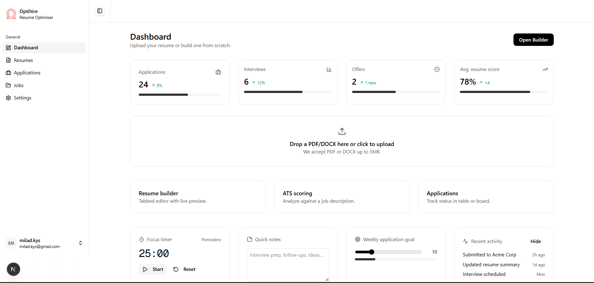
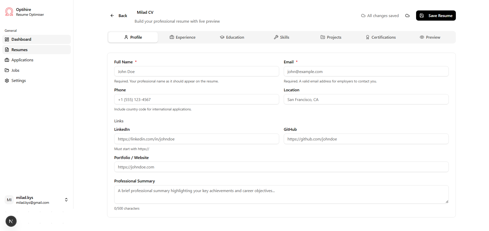

# Optihire


Optihire is a web platform that helps job seekers improve their CVs for Applicant Tracking Systems (ATS). This platform provides automated analysis, compatibility scoring, and actionable suggestions to increase your chances of landing an interview.

---

## 📸 Gallery

|              Analysis Dashboard              |                    Resume Builder                     |
| :------------------------------------------: | :---------------------------------------------------: |
|    |  |
| _Detailed parsing and compatibility scoring_ |     _Real-time resume editing with live preview_      |

---

## 🛠️ Getting Started

Follow these steps to get the development environment running.

### 1. Install Dependencies

First, install the necessary packages using pnpm:

```bash
pnpm install
```

### 2. Run the Development Server

Next, run the development server:

```bash
pnpm dev
```

Open http://localhost:3000 with your browser to see the result.

## Privacy

As part of Optihire, we store your account information (email and profile) and ATS analysis results to provide personaliSed compatibility scoring and feedback. Uploaded resume files are deleted within 24 hours of upload. All other user data is retained only to operate and improve the service and removed upon account deletion. Supabase acts as an identity sub-processor for authentication and user management.
